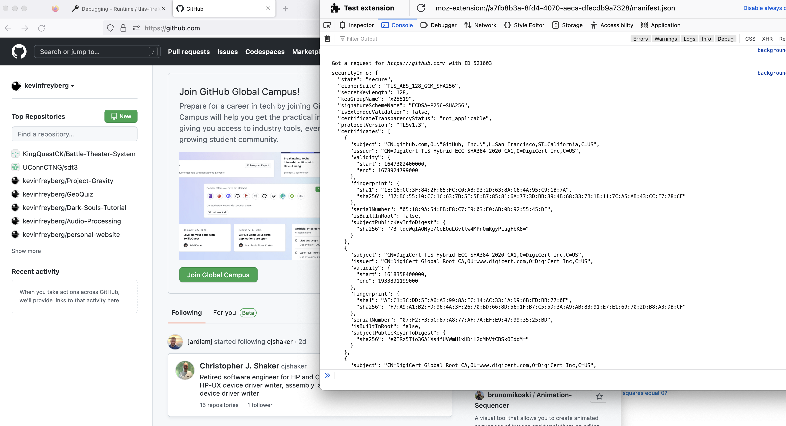

# CTNG
 
 In order to run this:
  - Go to Firefox "Manage Your Extensions" page
  - Hit the gear and go to "Debug Addons"
  - Load temporary add-on and point to manifest.json
  - To test, hit the inspect button and a console window will open with cert info

In the original CTng repo run this (for monitor listening on port 3000):
  - go build .
  - go run . minimon

In order to compile and use the browserify modules, you must compile them using browserify (https://browserify.org/).
This tool allows us to use Node.js modules in the browser by packaging them up in pure JS, which is what we use for 
the RSA, BLS, and SHA256 stuff. 

To compile browserify modules, you might have to use NPM in a separate folder or some codebase that has NPM. The command
we used is: browserify <your_module_name>.js -o <desired_output_file>.js

For example, to use the rsa.js module, we did: 
  - $ browserify rsa.js -o rsa-module.js